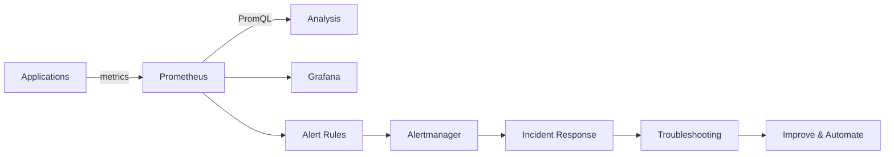

<div align="center">

# 🚀 Prometheus + Grafana Zero to Hero

### A hands-on observability journey from your first metric to real incident investigation.

**Prometheus · PromQL · Grafana · Alertmanager · Exporters · Kubernetes**

[](https://prometheus.io/)
[](https://grafana.com/)
[](https://kubernetes.io/)
[](https://www.docker.com/)
[](https://helm.sh/)

**The goal:** stop memorizing dashboards and start thinking like an observability engineer.

</div>

---

## ⭐ What This Repository Is

A **learn-by-doing observability lab** that takes you from fundamentals to production-style monitoring.

> **Learn → Build → Query → Visualize → Break → Troubleshoot → Improve**

## 🔭 Observability Architecture



This replaces the large ASCII diagram with a compact native GitHub diagram. GitHub supports Mermaid diagrams in Markdown. 

---

## 🗺️ Learning Path

| Stage | Focus | Outcome |
|:---:|---|---|
| **00** | 🧠 Foundations | Metrics, labels, types, cardinality & architecture |
| **01** | 🔥 Prometheus | Installation, configuration, targets, discovery & exporters |
| **02** | 🔎 PromQL | Selectors, aggregation, rates, histograms, joins & recording rules |
| **03** | 📊 Grafana | Datasources, dashboards, variables, panels & provisioning |
| **04** | 🚨 Alerting | Rules, Alertmanager, routing, silences & notifications |
| **05** | 🐧 Linux Monitoring | Node Exporter, CPU, memory, disk & network |
| **06** | ☸️ Kubernetes | KSM, nodes, pods, kube-prometheus-stack & alerts |
| **07** | 🧯 Real-World Labs | CPU, memory, disk, latency, CrashLoopBackOff & outages |
| **08** | 🏆 Projects | Linux, Kubernetes & production-style observability |

---

## 📚 Repository Roadmap

<details><summary><b>00 — Foundations</b></summary>

- Observability basics
- Metrics, labels & metric types
- Prometheus architecture

</details>

<details><summary><b>01 — Prometheus</b></summary>

- Installation
- Configuration
- Scrape targets
- Service discovery
- Exporters

</details>

<details><summary><b>02 — PromQL</b></summary>

- Selectors
- Aggregations
- `rate()` / `increase()`
- Histograms
- Joins
- Recording rules

</details>

<details><summary><b>03 — Grafana</b></summary>

- Prometheus datasource
- Dashboards
- Variables
- Panels
- Provisioning

</details>

<details><summary><b>04 — Alerting</b></summary>

- Alert rules
- Alertmanager
- Routing
- Silences
- Notification channels

</details>

<details><summary><b>05 — Linux Monitoring</b></summary>

- Node Exporter
- CPU
- Memory
- Disk
- Network

</details>

<details><summary><b>06 — Kubernetes</b></summary>

- kube-state-metrics
- Node monitoring
- Pod monitoring
- kube-prometheus-stack
- Kubernetes alerts

</details>

<details><summary><b>07 — Real-World Labs</b></summary>

- High CPU
- Memory leak
- Disk full
- High latency
- Pod CrashLoopBackOff
- Service down

</details>

<details><summary><b>08 — Portfolio Projects</b></summary>

- Linux observability
- Kubernetes observability
- Production monitoring stack

</details>

---

## 🧪 Learn by Breaking Things

| Scenario | Investigation Skills |
|---|---|
| 🔥 High CPU | Identify noisy processes and correlate CPU metrics |
| 🧠 Memory Leak | Detect growing memory usage and investigate trends |
| 💾 Disk Full | Find filesystem pressure before applications fail |
| 🐌 High Latency | Use histogram metrics and percentile analysis |
| ☸️ CrashLoopBackOff | Correlate pod, container and Kubernetes metrics |
| 🔴 Service Down | Distinguish target failure from application failure |

Every incident lab asks:

1. **What happened?**
2. **How did the metrics reveal it?**
3. **What was the root cause?**
4. **How do we prevent it next time?**

---

## 🧰 Technology Stack

| Tool | Role |
|---|---|
| Prometheus | Metrics collection & time-series storage |
| PromQL | Metrics querying & analysis |
| Grafana | Visualization & dashboards |
| Alertmanager | Alert routing & notification handling |
| Node Exporter | Linux host metrics |
| kube-state-metrics | Kubernetes object-state metrics |
| Docker Compose | Local learning environment |
| Kubernetes | Container orchestration labs |
| Helm | Kubernetes package management |

---

## ⚡ Quick Start

```bash
git clone <repository-url>
cd prometheus-grafana-zero-to-hero
```

Start with `00-foundations`, then progress through each stage in order.

Every module contains concepts, examples and hands-on exercises.

---

## 📈 Progress Tracker

- [ ] Observability fundamentals
- [ ] Prometheus installation & configuration
- [ ] Scraping & service discovery
- [ ] PromQL fundamentals
- [ ] Exporters
- [ ] Grafana dashboards & variables
- [ ] Alert rules & Alertmanager
- [ ] Linux monitoring
- [ ] Kubernetes monitoring
- [ ] Incident troubleshooting labs
- [ ] Linux observability project
- [ ] Kubernetes observability project
- [ ] Production monitoring stack

---

## 🎯 Skills You Will Build

- Design Prometheus scrape configurations
- Write practical PromQL queries
- Understand labels and cardinality
- Build useful Grafana dashboards
- Create actionable alerts
- Route and manage alerts with Alertmanager
- Monitor Linux infrastructure with exporters
- Monitor Kubernetes workloads and resources
- Troubleshoot incidents using metrics instead of guesswork
- Turn monitoring knowledge into operational runbooks

---

## 🏆 Portfolio Projects

### 🐧 Linux Observability
Complete host monitoring with Prometheus, Node Exporter and Grafana.

### ☸️ Kubernetes Observability
Monitor nodes, namespaces, workloads and pod health.

### 🏭 Production Monitoring Stack
Combine metrics, dashboards, alerts, Alertmanager, recording rules and incident runbooks.

---

## 📚 Official Resources

- Prometheus Documentation
- PromQL Documentation
- Grafana Documentation
- Alertmanager Documentation
- Kubernetes Documentation

---

## 🌟 Philosophy

> **Don't just build dashboards. Build the ability to explain what the system is doing.**

Build the stack → generate signals → break components → investigate evidence → fix the problem → document the lesson.

<div align="center">

### 🚀 First Metric → Production-Style Observability

**Learn. Build. Break. Troubleshoot. Improve.**

</div>

---

**Status:** 🚧 Actively building · **Roadmap:** 00 → 08 · **Focus:** Prometheus + Grafana + Kubernetes Observability